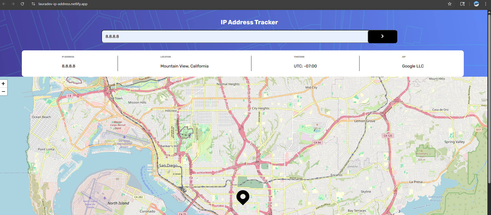
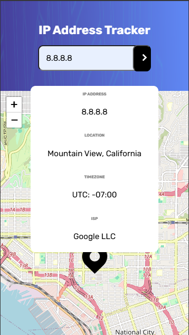

# Frontend Mentor - IP address tracker solution

This project is an interactive IP Address Tracker that allows users to input an IP address and view its associated geographic location on a map, rendered using Leaflet.js.

This is a solution to the [IP address tracker challenge on Frontend Mentor](https://www.frontendmentor.io/challenges/ip-address-tracker-I8-0yYAH0). Frontend Mentor challenges help you improve your coding skills by building realistic projects. 

## Table of contents

- [Overview](#overview)
  - [The challenge](#the-challenge)
  - [Screenshot](#screenshot)
  - [Links](#links)
- [My process](#my-process)
  - [Built with](#built-with)
  - [Development and Learning](#development-and-learning)
  - [Useful resources](#useful-resources)
- [Author](#author)

## Overview

This project is an interactive IP Address Tracker that allows users to input an IP address and view its associated geographic location on a map, rendered using Leaflet.js.

Key Features:
- IP Geolocation Lookup: Utilizes a geolocation API (e.g., IP Geolocation or IPify) to fetch data such as city, region, country, and coordinates from the entered IP address.

- Dynamic Map Integration: Displays the location on a Leaflet-powered map, complete with custom markers and popups.

- Responsive Design: Built with mobile-first principles using modern CSS techniques and media queries to ensure full usability across devices.

- Real-time Input Handling: Users can input any valid IP address, and the application dynamically fetches and displays updated information and map view.

### The challenge

Users should be able to:

- View the optimal layout for each page depending on their device's screen size
- See hover states for all interactive elements on the page
- See their own IP address on the map on the initial page load
- Search for any IP addresses or domains and see the key information and location

### Screenshot

Desktop IP Address Screenshot Laura Dev Website


Mobile IP Address Screenshot Laura Dev Website


### Links

- Solution URL: [Laura Dev Solution](https://www.frontendmentor.io/solutions/reactjs-leafletjs-vite-node-flexbox-grid-ip-geolocation-slUHzJs-z1)
- Live Site URL: [Laura Dev IP Address](https://lauradev-ip-address.netlify.app/)

## My process

### Built with

- Semantic HTML5 markup
- CSS custom properties
- Flexbox
- CSS Grid
- Mobile-first workflow
- [React](https://reactjs.org/) - JS library
- Node
- Leaflet API
- Geolocation IPify API
- Vite

### Development and Learning

 1. HTML Structure for Input and Button
You can't place a `<button>` inside an `<input>` tag because `<input>` is self-closing. This lets you position the button over the input without affecting the layout. To achieve the look of a button inside a search field:

- Wrap the input and button in a `<div>`.
- Set the container's `position` to `relative`.
- Set the button's `position` to `absolute`.

 2. Unexpected Syntax Error in `App.jsx`
I encountered an "unexpected token" error caused by an incomplete `import` statement. Always ensure your imports are complete—missing or partial imports will break the app.


 3. Creating a Divider Between IP Address Sections
Initially, I used a right border on a text `<div>` for a divider, but it added an extra line. Creating a separate `<div>` for the line gave better control and cleaner design.


 4. Installing Axios
I installed **Axios** to handle HTTP requests in the React app.  
Axios is a powerful alternative to Fetch and simplifies handling JSON and error responses.


 5. Protecting API Keys with `.env`
I stored the API key in a `.env` file to keep it secure and out of version control. This also helps when working across multiple environments.

 6. React Component Naming
I updated component names to use **PascalCase** (e.g., `SearchBar`).  
JSX treats lowercase tags as native HTML, so using uppercase tells React it's a custom component.


 7. Axios vs Fetch
Axios automatically parses JSON and throws errors for failed requests. Unlike Fetch, there’s no need to check `.ok` or call `.json()`.


 8. Updating API on Search Term Change
To ensure the API request updates with the search term:

- Pass `searchTerm` directly into the request.
- Include it in the `useEffect` dependency array to re-run when it changes.


 9. Search Button Behavior
I added a search button, but initially forgot to add logic. I fixed this by adding an `onClick` handler to trigger the search.

 10. Proper Use of `useEffect`
`useEffect` must be called at the **top level** of a functional component. It can't be used inside conditionals or nested functions.

 11. Loading State Fix
The app was stuck showing "Loading..." because:

- `loading` was initialized as `true`.
- I forgot to fetch data on initial render.

 12. `net::ERR_SSL_PROTOCOL_ERROR`
The browser blocks the connection due to an insecure protocol mismatch. Use the correct protocol based on the server configuration.This error occurred because:

- I used `https://` in my request.
- My server was running on `http://`.

 13. `.env` File Formatting
The `.env` file should include only key-value pairs.  
Avoid quotes or full URLs. Example:
```env
REACT_APP_API_KEY=yourKeyHere
```

## Useful resources

- React Leaflet Tutorial for Beginners (2023) (https://www.youtube.com/watch?v=jD6813wGdBA&t=467s)
- Leaflet (https://leafletjs.com/)
- Geolocation IPify (https://geo.ipify.org/)

## Author

- Website - [Laura V](www.lauradeveloper.com)
- Frontend Mentor - [@lavollmer](https://www.frontendmentor.io/profile/lavollmer)
- Github - [@lavollmer](https://github.com/lavollmer)